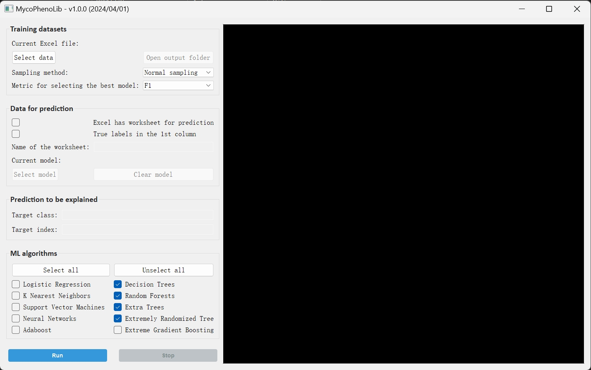

<!-- PROJECT LOGO -->

  
  <h1 align="center">
    MycoPhenoLib
  </h1>
  

    Construction of machine learning models for fungal taxonomic studies
  

  <a href="#download"><strong>Download »</strong></a>
   

<!-- GETTING STARTED -->
## Getting started
#### Installation
* Download the complete folder <V1> and run `MycoPhenoLib.py` or download pecked `MycoPhenoLib*.rar` file and run `MycoPhenoLib.exe`.
* The user interface will be like this:

#### How to use
To conduct a general process of model construction and feature importance analysis:
1. Click the 'Select data' button to select the input Excel file. Choose the sampling method and the metric for selecting the best model if necessary.
2. Select machine learning algorithms to be tested.
3. Click the 'Run' button.

To conduct prediction and specific interpretation:
1. Click the 'Select data' button to select the input Excel file.
2. Tick the 'Excel has worksheet for prediction' checkbox.
3. Click the 'Select model' button, if there is a trained model, to select the machine learning model.
4. Type the name of target class and order of target entry if conducting sample interpretation.

<!-- Outputs -->
## Outputs
Once the program finished running, output files will be generated in the folder `Out_ML` under the same directory as the input excel file.
- `Results.xlsx` file will record class information, normalized datasets, Pearson correlation coefficient, metrics of test classifiers, and predicted results if any.
- `Model.pkl` file will record the best fitted model with the best parameter, which can be read by the program for subsequent prediction and explanation process.
- `Metrics of classifiers.pdf` illustrate the accuracy, precision, recall, and F1 score of tested classifiers.
- `Feature importance - *.pdf` and `Global impact - *.pdf` file are the diagram showing global feature importance based on the best model using gini, permutation importance and Shapley values respectively.

* `Local_impact` folder will generate diagrams illustrating feature importance of each class.
* `Performance` folder will generate confusion matrix of tested classifiers demonstrating their predicting performance.
* `Sample_impact` folder will generate force plot illustrating individual predicting process of a single sample to a specific class.

<!-- All Released -->
## All Released
* [V1.0.0 (2024/04/01)](https://github.com/Jason-Zen/Fungal_Taxonomy/blob/master/MycoPhenoLib/Packed/MycoPhenoLib_v1.0.0_code.rar)
  * [Pack for windows](https://github.com/Jason-Zen/Fungal_Taxonomy/blob/v1.0.0/MycoPhenoLib/Packed/MycoPhenoLib_v1.0.0_windows.rar)

<!-- LICENSE -->
## License
Distributed under the MIT License. See `LICENSE.txt` for more information.

<!-- CONTACT -->
## Contact
Any question please feel free to contact: `xyzeng3@gzu.edu.cn`
